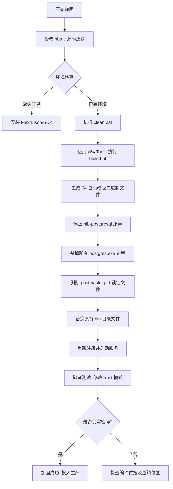

# PostgreSql_About
记录修改postgresql源码防止更改conf文件实现无密码登录的一次实战
# PostgreSQL 底层安全加固操作记录 (2025-12-18)

## 1. 任务背景

针对单机版软件中 PostgreSQL 10.20 存在的安全风险（用户可通过修改配置文件为 `trust` 绕过密码）进行底层加固。目标是实现**内核级拦截**，无论配置文件如何设置，强制执行 MD5 认证。

## 2. 核心源码修改

在 `src/backend/libpq/hba.c` 文件中，对 `parse_hba_line` 函数进行逻辑植入。

**代码逻辑：**

C

```c
/* 在函数返回前，强制将解析到的 trust 模式篡改为 md5 */
if (parsedline->auth_method == uaTrust)
{
    parsedline->auth_method = uaMD5;
}
return parsedline;
```

- **作用**：在内存中重写权限指令，使物理文件的 `trust` 设置失效。

## 3. 编译环境攻关

- **工具链**：Visual Studio 2022 (Build Tools)、Perl、Flex、Bison。
- **关键问题解决**：
  - **架构冲突**：初期使用 32 位编译，导致无法读取原 64 位数据，报错 `USE_FLOAT8_BYVAL`。
  - **解决对策**：切换至 `x64 Native Tools Command Prompt`，执行 `clean.bat` 后重新 `build.bat`。
  - **头文件缺失**：通过安装 Windows 10 SDK 解决了 `winldap.h` 等系统头文件丢失问题。

## 4. 部署与接管步骤

1. **进程清理**：强制终止所有 `postgres.exe` 进程，防止文件占用及 `sharing violation`。
2. **锁文件清理**：手动删除旧 `data` 目录下的 `postmaster.pid`。
3. **内核替换**：将新编译的 64 位 `bin` 目录覆盖至生产环境路径。
4. **服务重建**：
   - 删除旧服务：`sc delete hlb-postgresql`。
   - 注册新服务：`pg_ctl.exe register -N "postgresql" -D "数据目录路径" -w`。

## 5. 验证结果

- **配置文件**：`pg_hba.conf` 中显式写入 `host all all 127.0.0.1/32 trust`。
- **测试现象**：客户端连接时依然强制要求输入密码。
- **结论**：源码级加固成功，防御逻辑已闭环。

------

## 6. 操作流程图 

程式碼片段


